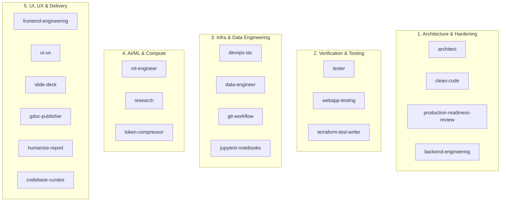

# Nexus: Summer 2027 Recruiting Portfolio & Technical Differentiator Analysis

**Target Candidate**: Aditya Hegde  
**Target Roles**: Software Engineering (Systems/Backend), AI Platform Engineering, Infrastructure/DevOps  
**Recruiting Target**: Summer 2027 SWE Internships  
**Repository**: [Nexus](https://github.com/AdityaHegde712/Nexus)  

---

## 1. Executive Summary & Core Positioning

Most university candidates entering the Summer 2027 recruiting cycle use AI as an undisciplined conversational chatbot—generating ad-hoc code snippets, accepting unverified hallucinations, and accumulating technical debt.

**Nexus establishes an entirely different tier of engineering maturity.** It demonstrates that the candidate treats AI coding agents not as a replacement for software engineering principles, but as a multi-agent distributed system governed by strict behavioral contracts, defensive isolation, deterministic execution, and formal verification.

Nexus provides tangible, reproducible evidence that the candidate operates with **Senior / Staff-level design heuristics**:
- Decoupled architecture across 3 distinct AI harnesses (Codex, Claude Code, Antigravity).
- Immutable test assertions and test-driven development (TDD) as non-negotiable boundaries.
- Hermetic runtime discipline via PEP 723 and `uv`.
- Full-lifecycle observability and adversarial verification.

---

## 2. Taxonomy & Structural Breakdown of the 20 Skills

The 20 skills in Nexus represent a comprehensive full-stack engineering lifecycle, grouped into five synergistic clusters:

### Cluster 1: Systems Architecture & Production Hardening
- **`architect`**: Enforces Principal/Staff System Design methodologies—RFC/ADR authoring, NFR matrices (latency, throughput, partition tolerance), trade-off ledgers, and phased rollout plans.
- **`production-readiness-review`**: Exhaustive pre-production hardening audit evaluating services across 9 axes (reliability, availability, performance, scalability, data integrity, security, observability, operability, cost) with line-level code citations.
- **`clean-code`**: Strict enforcement of Uncle Bob's Clean Code, SOLID, guard clauses, type annotations, and pathlib relative path resolution.
- **`backend-engineering`**: Clean/Hexagonal layering, ACID transactions, connection pooling, and safe Windows subprocess handling (eliminating `asyncio.create_subprocess_exec` deadlocks).

### Cluster 2: Immutable Verification & Quality Engineering
- **`tester`**: Governs the strict Red-Green-Refactor TDD cycle. Implements the **Test Immutability Contract**: implementation agents are forbidden from modifying or softening assertions to make tests pass.
- **`webapp-testing`**: Headless browser verification with Playwright for UI state assertions, DOM validation, and failure trace inspection.
- **`terraform-test-writer`**: Automated unit and integration testing for Infrastructure as Code modules using the native Terraform test framework.

### Cluster 3: Infrastructure, Data & Environment Reproducibility
- **`devops-iac`**: Declarative cloud provisioning (Terraform, AWS CDK), multi-stage Docker optimization, and deterministic tool resolution chains.
- **`data-engineer`**: Production ETL/ELT pipelines, schema validation, automated dataset profiling, and analytical columnar storage (DuckDB, Parquet, PostgreSQL).
- **`git-workflow`**: Production git hygiene—linear rebasing, conventional commits, isolated feature branches, and conflict resolution protocols.
- **`jupytext-notebooks`**: Solves the enterprise problem of noisy `.ipynb` git diffs by pair-syncing notebooks with clean, reviewable Python scripts.

### Cluster 4: ML Systems, Research & Compute Efficiency
- **`ml-engineer`**: End-to-end ML lifecycle—hyperparameter tracking, hardware target confirmation, ONNX/vLLM inference optimization, and mandatory small-scale smoke testing before expensive training runs.
- **`research`**: Evidence-grounded literature and technology comparison; includes automated quote and citation verification (`validate_quote.py`).
- **`token-compressor`**: Algorithmic instruction debloating and token optimization to maximize context window density without semantic loss.

### Cluster 5: Interface, Interaction & Technical Synthesis
- **`frontend-engineering`**: Component-Driven Development (CDD), strict separation of server and client state (TanStack Query, Zustand), and tokenized design systems (#121212 dark minimal theme).
- **`ui-ux`**: Interaction flows, heuristic evaluation, and visual rhythm governance.
- **`codebase-curator`**: Authors authoritative 12-section `CODEBASE.md` files, Excalidraw architecture blueprints, and inbound link audits.
- **`gdoc-publisher`**: Automated documentation publishing CLI integrating Pandoc and Google Drive API.
- **`slide-deck`**: HTML-first visual slide prototyping.
- **`humanize-report`**: Technical prose auditor removing AI-generated cliches and robotic cadence while strictly preserving technical facts, code fences, and metrics.

---

## 3. High-Signal Differentiators for Technical Interviews

When interviewing with hiring managers and staff engineers at top tech companies (FAANG, Datadog, Stripe, Snowflake, Cloudflare), cite these four concrete architectural decisions implemented in Nexus:

### Differentiator A: The Adversarial Subagent Review Model
- **The Problem**: A single agent generating and self-reviewing code suffers from confirmation bias and hallucination reinforcement.
- **Nexus Solution**: Decouples the generative process into two specialized roles:
  - `agents/developer.toml`: Optimized for implementation speed, architectural patterns, and passing unit tests.
  - `agents/adversary.toml`: Read-only security auditor and logic critic designed to challenge assumptions, identify OWASP risks, and demand reproducible failure proofs before sign-off.

### Differentiator B: Stateless Continuity Protocol (`.agent-tasks/`)
- **The Problem**: LLM sessions suffer from context compacting, token truncation, and lost state across restarts or model tier switches.
- **Nexus Solution**: An explicit tripartite state persistence protocol (`PLAN.md`, `DECISIONS.md`, `TASKS.md`). Any incoming agent or developer can resume execution with zero context loss after a single file inspection.

### Differentiator C: Hermetic Multi-Harness Sync (`scripts/sync_harness.py`)
- **The Problem**: Tooling built for one AI ecosystem (e.g. OpenAI Codex) breaks when transferred to Claude Code or Google Antigravity due to proprietary config formats and absolute path dependencies.
- **Nexus Solution**: Implemented a standalone Python translation engine declaring PEP 723 metadata that dynamically translates Codex TOML agent definitions into Claude/Antigravity Markdown prompts, formats directories with tilde (`~`) notation, and provides `--dry-run` simulation.

### Differentiator D: Self-Verifying Repository Architecture
- **The Problem**: Most prompt/agent repositories have no automated tests; broken markdown links, malformed TOML, or syntax errors are discovered only at runtime.
- **Nexus Solution**: Maintained an automated test suite (`tests/` running via `pytest` and `uv`) that validates:
  1. All 20 `SKILL.md` documents have valid, unbroken internal file links.
  2. All agent TOML specifications conform to required configuration schemas.
  3. Hook scripts handle stdin payloads and emit valid JSON contracts.
  4. Multi-harness translation logic produces expected outputs.

---

## 4. Resume Bullet Formulations

Use these tailored bullet points on your resume:

### For Systems / Backend Engineering:
> - **Architected Nexus**, a harness-agnostic personal agent operating system unifying workflows across OpenAI Codex, Anthropic Claude Code, and Google Antigravity with zero-context handoff protocols.
> - **Engineered an automated multi-harness translation layer** in Python (PEP 723, `uv`) translating agent specifications, lifecycle hooks, and 20 domain skills across disparate vendor schemas.
> - **Constructed automated test suite** using `pytest` validating JSON lifecycle hook schemas, TOML configurations, and internal markdown link graphs, ensuring 100% specification compliance.

### For AI Platform / Agent Systems:
> - **Designed an adversarial multi-agent orchestration architecture** decoupling code generation (`developer`) from read-only security and empirical critique (`adversary`).
> - **Implemented deterministic lifecycle hooks** with structured stderr diagnostics and late-night execution soft-locks, resolving dynamic runtime paths via Python `pathlib`.
> - **Authored 20 production-grade AI skills** spanning distributed systems architecture, immutable TDD assertions, infrastructure as code, and data profiling.

---

## 5. Conclusion

Nexus transforms personal agent tooling from a loose collection of prompt files into an **engineered, tested, and distributed software system**. It serves as verifiable proof of candidate maturity in software architecture, defensive engineering, and modern developer infrastructure.
