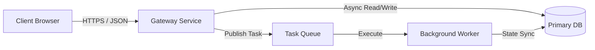

# Architectural Diagramming Standards: Mermaid & Excalidraw JSON

Reference for authoring visual representations of system architecture, request pipelines, and state topology.

---

## 1. Decision Matrix: Mermaid vs. Excalidraw JSON

| Scenario | Recommended Format | Output Destination |
| :--- | :--- | :--- |
| **Inline Markdown Context** | Mermaid (`graph LR` / `sequenceDiagram`) | Embedded directly in `CODEBASE.md` or `ARCHITECTURE.md` |
| **Complex Inter-Service Topology** | Excalidraw JSON (`.excalidraw`) | Standalone file in `docs/architecture/` |
| **Request / Response Temporal Flows** | Mermaid Sequence Diagram | Embedded in endpoint or service docs |
| **Interactive Design Reviews** | Excalidraw JSON | Exported for human review and collaborative editing |

---

## 2. Mermaid Diagram Standards

### Topology / Layering Rules (`graph LR` / `graph TD`)
- **Layout Direction**: Prefer `graph LR` (Left-to-Right) for ingress-to-database flows; prefer `graph TD` for strict hierarchy/inheritance.
- **Node Limit**: Cap diagrams at **12 nodes**. Group granular sub-modules into functional subsystems.
- **Explicit Edge Labels**: Every arrow connecting nodes must specify the protocol, channel, or transport (`HTTPS`, `SQL`, `Kafka`, `gRPC`, `import`, `ipc`).
- **Semantic Shapes**:
  - `Client[Web / Mobile Client]` — Rectangular boxes for UI or external actors.
  - `API[FastAPI Gateway]` — Square boxes for backend processing nodes.
  - `Queue[(Redis / Kafka)]` or `DB[(PostgreSQL)]` — Cylinders (`[(...)]`) for databases and state stores.



### Sequence Diagram Rules (`sequenceDiagram`)
- Use sequence diagrams when request lifecycles traverse >2 boundaries (e.g., Client → Auth Gateway → Downstream Microservice → Database).
- Always include `activate` / `deactivate` lifelines or return arrows (`-->>`).

---

## 3. Excalidraw JSON Standards

When generating `.excalidraw` structured JSON files:

### Schema Guidelines
Excalidraw files must be valid JSON matching the Excalidraw schema specification:

```json
{
  "type": "excalidraw",
  "version": 2,
  "source": "https://excalidraw.com",
  "elements": [
    {
      "id": "node_gateway",
      "type": "rectangle",
      "x": 100,
      "y": 100,
      "width": 180,
      "height": 70,
      "strokeColor": "#1e1e1e",
      "backgroundColor": "#e3fafc",
      "fillStyle": "solid",
      "strokeWidth": 2,
      "roughness": 1,
      "opacity": 100,
      "groupIds": [],
      "roundness": { "type": 3 },
      "seed": 104523,
      "version": 1,
      "versionNonce": 1,
      "isDeleted": false,
      "boundElements": null,
      "updated": 1,
      "link": null,
      "locked": false
    },
    {
      "id": "text_gateway",
      "type": "text",
      "x": 125,
      "y": 125,
      "width": 130,
      "height": 20,
      "fontSize": 16,
      "fontFamily": 1,
      "text": "API Gateway",
      "baseline": 15,
      "textAlign": "center",
      "verticalAlign": "middle",
      "containerId": null,
      "originalText": "API Gateway",
      "strokeColor": "#1e1e1e",
      "backgroundColor": "transparent",
      "fillStyle": "solid",
      "strokeWidth": 1,
      "roughness": 0,
      "opacity": 100,
      "groupIds": [],
      "roundness": null,
      "seed": 892341,
      "version": 1,
      "versionNonce": 1,
      "isDeleted": false,
      "boundElements": null,
      "updated": 1,
      "link": null,
      "locked": false
    }
  ],
  "appState": {
    "viewBackgroundColor": "#ffffff",
    "gridSize": 20
  },
  "files": {}
}
```

### Layout & Color Palette Discipline
- **Consistent Grid Coordinates**: Space nodes in increments of 40–80px on X/Y axes to maintain visual alignment.
- **Harmonious Palette**:
  - Ingress / UI: Light Blue (`#e3fafc`)
  - Core API / Services: Light Indigo (`#edf2ff`)
  - Storage & DB: Light Green (`#ebfbee`)
  - External / Third-party: Light Orange (`#fff4e6`)
  - Text & Borders: Dark Slate (`#1e1e1e` / `#212529`)
