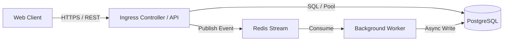

# CODEBASE.md & Architecture Documentation Section Guide

Reference for the `codebase-curator` skill. Consult this guide when authoring or reviewing system documentation.

---

## Standard Section Ordering & Rules

Every section must contain concrete, non-obvious technical facts. Skip optional sections if the repository does not have genuine content for them.

---

### 1. Header Block (Required)

```markdown
# Codebase Overview

> Capability statement: What the system executes, its operational purpose, and primary boundary.

**Last Updated:** YYYY-MM-DD  
**Primary Language & Runtime:** [Language + Version]  
**Architecture Pattern:** [Modular Monolith | Microservices | Distributed | CLI | Library | Serverless]
```

*Rule*: The one-sentence overview must state what the system *does* (capability), not what it *is* (marketing fluff).
- **Good**: `Event-driven indexing pipeline that ingests Canvas LMS course payloads and serves optimized JSON viewports via FastAPI.`
- **Bad**: `A modern, fast, and robust aggregator for student course management.`

---

### 2. Architecture Overview & Topology (Required)

A high-signal technical description (3–8 sentences) detailing:
- Top-level layers/subsystems and single-responsibility boundaries.
- Request lifecycle / job execution path (ingress to egress).
- State boundaries (primary DB, caching layer, ephemeral disk, in-memory state).
- Asynchronous boundaries (queues, background threads, webhooks).

Followed by an inline Mermaid diagram or a reference to an Excalidraw architecture diagram:



---

### 3. Tech Stack & Constraints Matrix (Required)

A concise markdown table highlighting load-bearing technologies and non-obvious engineering constraints.

```markdown
| Layer / Subsystem | Technology | Constraints & Implementation Notes |
| :--- | :--- | :--- |
| **Runtime** | Python 3.12 / Node 22 | Asyncio native; strict typing enforced |
| **API Framework** | FastAPI | Pydantic v2 schemas; lifespan context managers |
| **Database** | PostgreSQL 16 | SQLAlchemy 2.0 async engine; explicit joins only |
| **Cache & State** | Redis 7 | Distributed locking & session invalidation |
| **Testing** | Pytest / Playwright | Real Postgres container fixtures (no unit mocks for DB) |
| **Build & Tooling** | Vite / uv | Zero global package reliance; locked via pyproject.toml |
```

---

### 4. Entry Points & Lifecycle (Required if Multi-Surface)

Document all application entry points, CLI commands, and worker startup sequences:

```markdown
## Entry Points

| Surface | Invocation Command | Lifecycle / Bootstrap Notes |
| :--- | :--- | :--- |
| **API Server** | `uvicorn app.main:app --port 8000` | Initializes connection pools and loads flag cache |
| **Worker** | `python -m app.worker` | Must start after Redis cluster health check passes |
| **Migration** | `alembic upgrade head` | Strictly idempotent; executed pre-deployment |
| **CLI Tools** | `python -m app.cli --help` | Internal maintenance utilities; bypasses API auth |
```

---

### 5. Key Modules & Danger Zones (Required)

Curate the top 5–15 critical modules. Group by architectural responsibility.

```markdown
## Key Modules

| Path | Architectural Responsibility |
| :--- | :--- |
| `src/core/` | Core configuration, dependency injection container, telemetry. |
| `src/domain/` | Pure business entities and domain validation logic (no I/O). |
| `src/adapters/` | Database repositories, external API clients, message publishers. |
| `src/api/` | HTTP route controllers, request validation, response serialization. |
```

#### Danger Zones & High-Risk Tripwires
Highlight mission-critical files where minor edits produce system-wide side effects:

```markdown
> [!WARNING]
> `src/core/auth_middleware.py` enforces token validation and tenancy isolation for all routes. Edits require full E2E test verification before merging.
```

---

### 6. Data Layer & Persistence Models (Required if Persistent)

Document storage systems, schemas, and persistence constraints:
- **Schema Management**: Alembic / Prisma / Flyway versioning locations.
- **Table / Collection Archetypes**:
  - `users`: Authenticated principals (soft-deleted via `deleted_at`).
  - `audit_events`: Append-only immutable log (never updated).
- **Non-Obvious Data Patterns**:
  - Soft-deletes vs hard-deletes.
  - Multi-tenancy isolation (row-level tenancy ID vs separate schemas).
  - DB trigger automation (e.g., auto-updating `updated_at` or audit triggers).

---

### 7. Non-Obvious Patterns & Conventions (Highest ROI Section)

Document counterintuitive rules that prevent AI coding agents and engineers from writing bug-ridden code:

```markdown
## Non-Obvious Patterns

- **Result Monads over Uncaught Exceptions**: Domain handlers return `Result[Success, DomainError]` rather than throwing exceptions. Route adapters map errors directly to HTTP status codes.
- **Async I/O Concurrency Guard**: Never invoke blocking synchronous functions (`time.sleep()`, synchronous `requests`, or sync ORM queries) inside async endpoints; use `asyncio.to_thread` or native async drivers.
- **Transactional Outbox**: State changes and message queue events are committed together in a single DB transaction before external dispatch.
```

---

### 8. Development & Verification Workflow (Required)

Deterministic, copy-pasteable commands for development, linting, type-checking, and testing:

```markdown
## Development Workflow

```bash
# 1. Environment Setup
uv venv && source .venv/bin/activate
uv pip install -e ".[dev]"

# 2. Local Infrastructure
docker compose up -d postgres redis

# 3. Database Migration
alembic upgrade head

# 4. Run Test Suite
pytest -v --tb=short
```

**Static Analysis & Quality Gates**:
- Linting: `ruff check . --fix`
- Type Checking: `mypy src/`
- Format: `ruff format .`
```

---

### 9. CI/CD & Deployment Gates (Include if CI Configured)

Detail automated pipeline behavior and deployment barriers:
- **Pull Request Checks**: Lint → Type Check → Unit Tests → Integration Suite (all mandatory).
- **Deployment Flow**: Merges to `main` trigger immutable Docker builds and automated canary deployment.
- **Required Secrets**: `DATABASE_URL`, `REDIS_URL`, `AUTH_SIGNING_KEY`.

---

### 10. Architectural Decision Records (ADRs)

Summarize 2–5 critical architectural decisions, tradeoffs, and rejected alternatives:

```markdown
## Architecture Decisions

- **PostgreSQL over MongoDB**: Selected for strict ACID transactions and relational foreign key constraints across billing and user entities.
- **Vite SPA over SSR**: Selected because the aggregator application is dashboard-heavy behind authentication where SEO is non-applicable and client-side caching delivers sub-10ms UI renders.
```

---

### 11. Domain Glossary (Include if Domain-Specific)

Define ambiguous terms unique to the business domain:

| Domain Term | Definition in this Codebase | Anti-Definition / What it is NOT |
| :--- | :--- | :--- |
| **Aggregator Viewport** | Dynamic snapshot of merged student assignments. | Not a full database replica. |
| **Principal** | Validated JWT subject (User or Service Token). | Not a financial entity. |

---

### 12. Things to Know Before Changing Code (Tripwires)

Explicit warnings and hidden constraints:
- Modifying database models requires generating and committing an Alembic migration script.
- Background tasks in `src/tasks/` must remain idempotent because Celery provides at-least-once delivery guarantees.
- Always check `tests/conftest.py` for shared fixtures before authoring new test mocks.

---

## Monorepo Addendum

For monorepos, provide a **Services & Packages Topology Map** directly beneath the header block:

```markdown
## Workspace Packages

| Package | Relative Path | Role & Language | Core Dependencies |
| :--- | :--- | :--- | :--- |
| `frontend` | `apps/web/` | React 18 / TypeScript SPA | `@workspace/shared-types` |
| `api-server`| `apps/api/` | FastAPI Python service | PostgreSQL, Redis |
| `shared` | `packages/common/` | Shared TypeScript DTOs | None (zero-dependency) |
```
